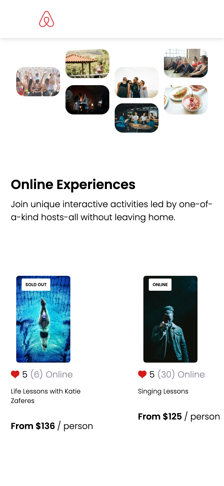

# Airbnb Clone

## Project Overview

This project is an Airbnb clone created as part of the Learn React course on Scrimba. The focus of this project was to practice using props in React, and to implement the design using CSS Grid. 

Even though this is a tutorial-based project, the design was primarily developed using a screenshot from Figma as a reference. The tutorial was used minimally, with most of the design and layout figured out independently using the React app.

## Screenshot

## Key Features

- **React**: Built with React to manage the UI components and state.
- **JavaScript**: ES6 features were used throughout the project for cleaner and more efficient code.
- **CSS Grid**: The layout is created using CSS Grid, allowing for a flexible and responsive design.
- **Custom Design**: The app's design is heavily inspired by a Figma screenshot, which was recreated in the project with minimal reliance on the tutorial instructions.

## How to Run

To run the project locally:

1. Clone this repository.
2. Navigate to the project directory.
3. Install dependencies using `npm install`.
4. Start the development server with `npm start`.
5. Open [http://localhost:3000](http://localhost:3000) in your browser.

